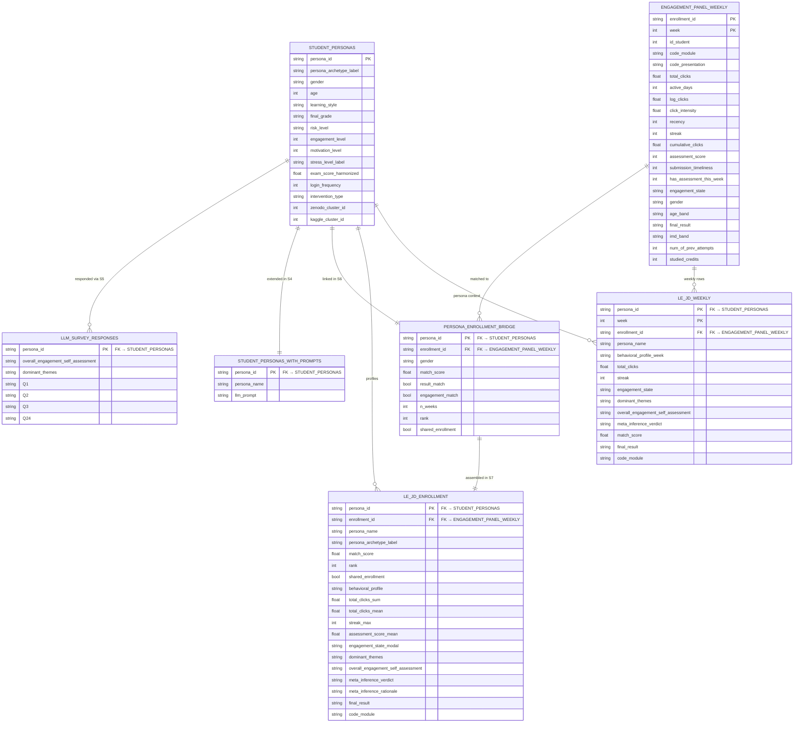

# From Clicks to Constructs: A Mixed-Methods Framework for Modeling Latent Student Engagement Using OULAD Data

> This document describes the full data pipeline of the project, tracing every step linearly from the research proposal (`proposal.md`) through every processing stage to the final CSV artifacts that feed the **Latent Engagement Joint Display (LE-JD)**.

---

## Table of Contents

- [From Clicks to Constructs: A Mixed-Methods Framework for Modeling Latent Student Engagement Using OULAD Data](#from-clicks-to-constructs-a-mixed-methods-framework-for-modeling-latent-student-engagement-using-oulad-data)
  - [Table of Contents](#table-of-contents)
  - [1. Research Foundation — `proposal.md`](#1-research-foundation--proposalmd)
  - [2. Repository Layout](#2-repository-layout)
  - [3. Pipeline Overview](#3-pipeline-overview)
  - [4. Quantitative Strand — OULAD (P0 → P6)](#4-quantitative-strand--oulad-p0--p6)
    - [Data Sources](#data-sources)
    - [P0 — Foundation](#p0--foundation)
    - [P1 — Ingestion](#p1--ingestion)
    - [P2 — Panel Builder](#p2--panel-builder)
    - [P3 — Behavioral Indicators](#p3--behavioral-indicators)
    - [P4 — Assessment Join](#p4--assessment-join)
    - [P5 — Demographics Join](#p5--demographics-join)
    - [P6 — Export](#p6--export)
    - [Final Quantitative Artifact](#final-quantitative-artifact)
      - [Column Reference](#column-reference)
  - [5. Synthetic Qualitative Strand (S0 → S7)](#5-synthetic-qualitative-strand-s0--s7)
    - [External Data Sources](#external-data-sources)
    - [S0 — Ingest External Sources](#s0--ingest-external-sources)
    - [S1 — Decode and Normalize](#s1--decode-and-normalize)
    - [S2 — Cluster and Map](#s2--cluster-and-map)
    - [S3 — Persona Assembly](#s3--persona-assembly)
    - [S4 — Generate Prompts](#s4--generate-prompts)
    - [S5 — LLM Survey](#s5--llm-survey)
    - [S6 — Persona-Enrollment Bridge](#s6--persona-enrollment-bridge)
    - [S7 — LE-JD Assembly](#s7--le-jd-assembly)
    - [Final Qualitative Artifacts](#final-qualitative-artifacts)
  - [6. Integration — The LE-JD Artifact](#6-integration--the-le-jd-artifact)
    - [Four-Column Structure](#four-column-structure)
    - [Case Unit](#case-unit)
    - [Aggregation Levels](#aggregation-levels)
    - [Data Flow into the LE-JD](#data-flow-into-the-le-jd)
  - [7. Diagrams](#7-diagrams)
  - [7b. Entity-Relationship Diagram](#7b-entity-relationship-diagram)
  - [8. How to Run](#8-how-to-run)
    - [Prerequisites](#prerequisites)
    - [Execution Order](#execution-order)
    - [Intermediate Database](#intermediate-database)

---

## 1. Research Foundation — `proposal.md`

The entire pipeline originates from [`proposal.md`](proposal.md), the final paper proposal that defines:

- **Paper title:** *From Clicks to Constructs: A Mixed-Methods Framework for Modeling Latent Student Engagement Using OULAD Data*
- **Central problem:** LMS behavioral data (clicks, logins) are only partial proxies of engagement. Key latent dimensions — motivation, cognitive effort, perceived value — remain invisible in log data alone ("N = all fails").
- **Research questions:**
  - **RQ1:** How can student engagement be modeled as a latent construct using behavioral data from OULAD?
  - **RQ2:** What temporal and structural patterns characterize engagement trajectories?
  - **RQ3:** What mechanisms explain observed engagement behaviors?
  - **RQ4:** How can quantitative and qualitative evidence be integrated into a unified representation of engagement?
- **Design:** Convergent mixed-methods — parallel quantitative (Dynamic Bayesian Network on OULAD) and qualitative (semi-structured interviews / simulated via LLM survey) strands, integrated through the LE-JD.
- **Appendix A (interview instrument):** 24 questions (Q1–Q24) organized across six thematic domains: temporal engagement, motivational dynamics, assessment strategy, cognitive load, perceived value, and self-regulation. These questions drive the LLM survey in S4/S5.

The supplementary document [`proposal_artifact.md`](proposal_artifact.md) defines the LE-JD structure and maps every CSV column to a specific analytical role in the final artifact.

---

## 2. Repository Layout

```
next_proposal_paper/
├── proposal.md                     # Research design and interview instrument (Appendix A, Q1–Q24)
├── proposal_artifact.md            # LE-JD structure and CSV column mapping
├── README.md                       # This file
│
├── src/                            # Quantitative Strand (P0–P6)
│   ├── P0_foundation.py
│   ├── P1_ingestion.py
│   ├── P2_panel_builder.py
│   ├── P3_indicators.py
│   ├── P4_assessment_join.py
│   ├── P5_demographics_join.py
│   └── P6_export.py
│
├── src_syntetic/                   # Synthetic Qualitative Strand (S0–S7)
│   ├── S0_ingest_external_sources.py
│   ├── S1_decode_and_normalize.py
│   ├── S2_cluster_and_map.py
│   ├── S3_persona_assembly.py
│   ├── S4_generate_prompts.py
│   ├── S5_run_llm_survey.py
│   ├── S6_persona_enrollment_bridge.py
│   └── S7_le_jd_assembly.py
│
├── outputs/
│   ├── engagement_panel_weekly.csv             # FINAL — Quantitative strand output
│   ├── data/
│   │   ├── engagement.duckdb                   # DuckDB intermediate database
│   │   ├── raw/
│   │   │   ├── merged_dataset.csv              # Zenodo raw download
│   │   │   └── psychological_cbi_dataset.csv   # Kaggle raw download
│   │   └── synthetic/
│   │       ├── zenodo_decoded.csv
│   │       ├── kaggle_normalized.csv
│   │       ├── zenodo_clustered.csv
│   │       ├── kaggle_clustered.csv
│   │       ├── persona_pairs.csv               # 1,300 matched student profiles
│           ├── student_personas.csv            # FINAL — 1,300 × 38 persona profiles
│           ├── student_personas_with_prompts.csv
│           ├── llm_responses/                  # P{id}.json — 1,300 individual responses
│           ├── llm_survey_responses.csv        # FINAL — 1,300 × 27 qualitative responses
│           ├── persona_enrollment_bridge.csv   # FINAL — 1,300 × 9, 1 unique enrollment per persona
│           ├── le_jd_enrollment.csv            # FINAL — 1,300 × 65, primary LE-JD artifact
│           └── le_jd_weekly.csv               # FINAL — 48,241 × 29, temporal LE-JD
│   └── metadata/
│       ├── column_schema.json                  # Auto-generated column audit
│       ├── environment_summary.json
│       └── pipeline_audit.json
│
├── pipeline_diagram.dot / .png / .svg          # Detailed pipeline diagram
├── pipeline_diagram_macro.dot / .png / .svg    # Macro-level stage diagram
└── pipeline_diagram_dfd.dot / .png / .svg      # DFD Level-1 diagram
```

OULAD source CSVs are **read-only** and located outside this repository at `../../content/`.

---

## 3. Pipeline Overview

```
proposal.md (research design + RQs + Q1–Q24 instrument)
        │
        ├─────────────────────────────────────────────────┐
        ▼                                                 ▼
QUANTITATIVE STRAND                           SYNTHETIC QUALITATIVE STRAND
  OULAD + DuckDB (P0 → P6)                     Zenodo + Kaggle + Claude API (S0 → S6)
        │                                                 │
        ▼                                                 ▼
engagement_panel_weekly.csv           student_personas.csv
        │                             llm_survey_responses.csv
        │                                                 │
        └─────────────────┬───────────────────────────────┘
                          ▼
            persona_enrollment_bridge.csv
                          │
                          ▼
              Latent Engagement Joint Display (LE-JD)
              [Dynamic Bayesian Network output + qualitative mechanisms]
```

Both strands run fully in parallel. The bridge (S6) is the only step that consumes outputs from both.

---

## 4. Quantitative Strand — OULAD (P0 → P6)

### Data Sources

| File | Rows | Description |
|---|---|---|
| `studentVle.csv` | ~10.6 M | Daily VLE interaction logs: `id_student`, `code_module`, `code_presentation`, `id_site`, `date`, `sum_click` |
| `studentInfo.csv` | 32,593 | Enrollment demographics and final results |
| `studentAssessment.csv` | ~173 K | Assessment submission records with scores and dates |
| `assessments.csv` | ~206 | Assessment definitions with deadlines (`date`) |
| `courses.csv` | 22 | Module metadata including `module_presentation_length` |

All files reside at `../../content/` (read-only).

---

### P0 — Foundation

**Script:** `src/P0_foundation.py`

Validates the presence and integrity of all five OULAD CSVs, installs required Python dependencies, and builds the `outputs/` directory tree. Writes two metadata files:

- `outputs/metadata/environment_summary.json` — Python version, installed packages, file checksums
- `outputs/metadata/pipeline_audit.json` — run timestamp, detected file sizes, validation results

**Outputs:** validated environment; no data transformed.

---

### P1 — Ingestion

**Script:** `src/P1_ingestion.py`

Reads the five source CSVs and loads them into a **DuckDB** database (`outputs/data/engagement.duckdb`), validating schemas and row counts against expected values.

**DuckDB tables created:**

| Table | Source |
|---|---|
| `raw_student_vle` | `studentVle.csv` |
| `raw_student_info` | `studentInfo.csv` |
| `raw_student_assessment` | `studentAssessment.csv` |
| `raw_assessments` | `assessments.csv` |
| `raw_courses` | `courses.csv` |

**Outputs:** `engagement.duckdb` with five raw tables.

---

### P2 — Panel Builder

**Script:** `src/P2_panel_builder.py`

Constructs the person–week panel structure:

1. Converts VLE `date` (days from module start) to calendar weeks.
2. Aggregates daily clicks into weekly totals per `enrollment_id × week`.
3. Fills zero-click weeks (ensures all enrollments have a row for every week 0–38).
4. Computes `active_days` — the number of distinct days with at least one click within the week.

**DuckDB table created:** `panel_base`  
**Columns:** `enrollment_id`, `week`, `total_clicks`, `active_days`

---

### P3 — Behavioral Indicators

**Script:** `src/P3_indicators.py`

Derives six behavioral indicators from the panel base:

| New Column | Description |
|---|---|
| `log_clicks` | `log1p(total_clicks)` — removes right skew; primary DBN input |
| `click_intensity` | `total_clicks` normalized within module/presentation/week cohort → [0, 1] |
| `cumulative_clicks` | Running sum of `total_clicks` per enrollment; tracks trajectory |
| `recency` | Weeks since the last week with `total_clicks > 0`; captures inactivity duration |
| `streak` | Consecutive active weeks ending at the current week; captures habit formation |
| `engagement_state` | Contextual NTILE(3) on `log_clicks` within module/presentation/week → `{low, medium, high}` (validation proxy, not the latent state) |

**DuckDB table created:** `panel_indicators`

---

### P4 — Assessment Join

**Script:** `src/P4_assessment_join.py`

Joins the panel with assessment data:

1. Converts assessment `date` deadlines to weeks.
2. Matches submissions to the enrollment's week-level panel.

| New Column | Description |
|---|---|
| `assessment_score` | Score (0–100); null when no assessment submitted that week (87.75% null) |
| `submission_timeliness` | Days early (positive) or late (negative) relative to deadline |
| `has_assessment_this_week` | Binary flag (0/1) indicating a deadline falls in this week |

**DuckDB table created:** `panel_with_assessment`

---

### P5 — Demographics Join

**Script:** `src/P5_demographics_join.py`

Joins the panel with enrollment-level demographic attributes from `raw_student_info`:

| New Column | Values |
|---|---|
| `age_band` | `0-35`, `35-55`, `55<=` |
| `gender` | `F`, `M` |
| `highest_education` | `A Level or Equivalent`, `HE Qualification`, `Lower Than A Level`, `No Formal quals`, `Post Graduate Qualification` |
| `imd_band` | Decile bands `0-10%` through `90-100%` (3.41% null) |
| `num_of_prev_attempts` | Integer 0–6; number of prior attempts at this module |
| `studied_credits` | Integer 30–655; total credit load for this presentation |
| `final_result` | `Pass`, `Fail`, `Withdrawn`, `Distinction` |

**DuckDB table created:** `panel_with_demographics`

---

### P6 — Export

**Script:** `src/P6_export.py`

Selects the final 22 columns, runs a full data quality audit (null checks, range checks, category validation), and exports to CSV.

Validates that:
- `engagement_state` ∈ `{low, medium, high}`
- `final_result` ∈ `{Pass, Fail, Withdrawn, Distinction}`
- No nulls in structural columns (`enrollment_id`, `week`, `total_clicks`, etc.)

Writes `outputs/metadata/column_schema.json` (auto-generated type/range/null profile).

**Output:** `outputs/engagement_panel_weekly.csv`

---

### Final Quantitative Artifact

**File:** `outputs/engagement_panel_weekly.csv`

| Dimension | Value |
|---|---|
| Rows | 1,212,577 |
| Unique enrollments | 32,593 |
| Weeks | 0–38 (39 unique values) |
| Columns | 22 |

#### Column Reference

| # | Column | Type | Range / Values | LE-JD Role |
|---|---|---|---|---|
| 1 | `enrollment_id` | object | 32,593 unique | Row identifier |
| 2 | `id_student` | int64 | 3,733 – 2,716,795 | Student identifier |
| 3 | `code_module` | object | AAA – GGG (7 modules) | Stratification |
| 4 | `code_presentation` | object | 2013B / 2013J / 2014B / 2014J | Stratification |
| 5 | `week` | int64 | 0 – 38 | Temporal axis |
| 6 | `total_clicks` | float64 | 0 – 6,991 (mean 30.89) | Behavioral indicator |
| 7 | `active_days` | int64 | 0 – 7 (mean 1.40) | Behavioral indicator |
| 8 | `log_clicks` | float64 | 0 – 8.85 (mean 1.64) | DBN input node |
| 9 | `click_intensity` | float64 | 0 – 1 (mean 0.044) | DBN input node |
| 10 | `recency` | int64 | 0 – 39 (mean 5.84) | DBN input node |
| 11 | `streak` | int64 | 0 – 39 (mean 3.88) | DBN input node |
| 12 | `cumulative_clicks` | float64 | 0 – 23,481 (mean 687) | Trajectory plot |
| 13 | `assessment_score` | Int64 | 0 – 100 (87.75% null) | DBN input (sparse) |
| 14 | `submission_timeliness` | Int64 | −174 to +244 days (87.98% null) | DBN input (sparse) |
| 15 | `has_assessment_this_week` | int32 | 0 / 1 (mean 0.12) | Deadline context flag |
| 16 | `engagement_state` | object | `low` / `medium` / `high` | Validation proxy for DBN |
| 17 | `age_band` | object | `0-35`, `35-55`, `55<=` | Demographic context |
| 18 | `gender` | object | `F`, `M` | Demographic context |
| 19 | `highest_education` | object | 5 categories | Prior capital context |
| 20 | `imd_band` | object | 10 decile bands (3.41% null) | Socioeconomic context |
| 21 | `num_of_prev_attempts` | int | 0 – 6 | Experience context |
| 22 | `studied_credits` | int | 30 – 655 | Workload context |
| 23 | `final_result` | object | `Pass`, `Fail`, `Withdrawn`, `Distinction` | Outcome lens |

> **Note:** `engagement_state` is a NTILE-3 proxy used to **validate** the DBN output — it is not the latent engagement state itself. The true latent state is inferred by the Dynamic Bayesian Network trained on columns 8–15.

---

## 5. Synthetic Qualitative Strand (S0 → S7)

This strand constructs a synthetic student population that stands in place of real interview participants for the purposes of the mixed-methods integration exercise. Each synthetic student receives a behavioral profile (from external datasets), an archetype label, and a set of open-ended survey responses generated by a Large Language Model using the Q1–Q24 instrument from `proposal.md`.

### External Data Sources

| Source | Dataset | Rows | Purpose |
|---|---|---|---|
| Zenodo DOI 10.5281/zenodo.16459132 | `merged_dataset.csv` | 14,003 | Student engagement indicators with LabelEncoder-encoded columns |
| Kaggle `psychological-cbi-student-dataset` | `psychological_cbi_dataset.csv` | 1,300 | Psychological / cognitive-behavioral constructs |

---

### S0 — Ingest External Sources

**Script:** `src_syntetic/S0_ingest_external_sources.py`

Downloads both external datasets:
- Zenodo: via direct HTTP download from DOI
- Kaggle: via Kaggle API or manual placement

Validates integrity using **SHA-256 checksums** for both files.

**Outputs:**
- `outputs/data/raw/merged_dataset.csv`
- `outputs/data/raw/psychological_cbi_dataset.csv`

---

### S1 — Decode and Normalize

**Script:** `src_syntetic/S1_decode_and_normalize.py`

Prepares both datasets for clustering and merging:

1. **Decodes** Zenodo columns previously encoded with scikit-learn `LabelEncoder` (reverting integer codes back to human-readable categories).
2. **Normalizes** six bridge constructs from the Kaggle dataset to [0, 1]:
   - `attendance`, `assignment`, `exam`, `motivation`, `stress`, `discussion`

These six constructs form the shared feature space used to match Zenodo students to Kaggle students in S2.

**Outputs:**
- `outputs/data/synthetic/zenodo_decoded.csv`
- `outputs/data/synthetic/kaggle_normalized.csv`

---

### S2 — Cluster and Map

**Script:** `src_syntetic/S2_cluster_and_map.py`

Performs a two-step matching process to pair 1,300 Kaggle students with 1,300 Zenodo students:

1. **KMeans clustering** applied independently to each dataset on the six normalized bridge constructs.
2. **NearestNeighbors** (1-to-1, no replacement) maps each Kaggle student to the closest Zenodo student within the same cluster, using Euclidean distance in the normalized construct space.

**Outputs:**
- `outputs/data/synthetic/zenodo_clustered.csv`
- `outputs/data/synthetic/kaggle_clustered.csv`
- `outputs/data/synthetic/persona_pairs.csv` — 1,300 matched (Kaggle_id, Zenodo_id) pairs

---

### S3 — Persona Assembly

**Script:** `src_syntetic/S3_persona_assembly.py`

Merges each matched pair into a unified 37-column persona profile. Assigns one of **eight archetypes** based on the combination of academic risk level, motivation tier, and stress tier:

| Archetype | Risk | Motivation | Stress |
|---|---|---|---|
| Flourishing Achiever | Low | High | Low |
| Engaged but Pressured | Low | High | High |
| Routine Complier | Low | Medium | Medium |
| Resilient Climber | Medium | High | Low–Medium |
| Steady Performer | Medium | Medium | Low |
| Overwhelmed Striver | High | High | High |
| Crisis Learner | High | Medium | High |
| Disengaged Drifter | High | Low | Any |

Each persona also receives a unique **internationally diverse name** (drawn from ~25 nationalities) for contextual realism in the LLM prompts.

**Output:** `outputs/data/synthetic/student_personas.csv` — **1,300 rows × 37 columns**

---

### S4 — Generate Prompts

**Script:** `src_syntetic/S4_generate_prompts.py`

Builds the LLM prompt for each of the 1,300 personas by:

1. Embedding the Q1–Q24 interview instrument from `proposal.md` (Appendix A) across six thematic domains:
   - Temporal engagement patterns
   - Motivational dynamics
   - Assessment strategy and deadline behavior
   - Cognitive load and effort
   - Perceived value of learning tasks
   - Self-regulation and habit formation
2. Injecting the persona's archetype, behavioral profile, demographic attributes, and assigned name into a **one-shot prompt** template.
3. Appending a JSON schema instruction that constrains the model's response format.

**Output:** `outputs/data/synthetic/student_personas_with_prompts.csv`

---

### S5 — LLM Survey

**Script:** `src_syntetic/S5_run_llm_survey.py`

Executes 1,300 Claude API calls, one per persona:

| Parameter | Value |
|---|---|
| Model | `claude-opus-4-5` |
| Concurrent workers | 5 |
| Retry strategy | Exponential backoff, `MAX_RETRIES = 5` |
| Resume safety | Checks existing `llm_responses/P{id}.json` before calling API |
| Validation | JSON schema checked per response; malformed responses trigger retry |

Each response contains answers to Q1–Q24 in structured JSON. Responses are written individually to `outputs/data/synthetic/llm_responses/P{id}.json` and then consolidated into a single CSV.

**Outputs:**
- `outputs/data/synthetic/llm_responses/P{id}.json` (1,300 individual files)
- `outputs/data/synthetic/llm_survey_responses.csv` — **FINAL qualitative response dataset**

---

### S6 — Persona-Enrollment Bridge

**Script:** `src_syntetic/S6_persona_enrollment_bridge.py`

Links each synthetic persona to exactly one real OULAD enrollment from `engagement_panel_weekly.csv` with **guaranteed uniqueness**, enabling genuine quant–quali comparison in the LE-JD. The process runs in two steps:

**Step 1 — Candidate scoring (top 30 per persona).** Matching uses a weighted similarity score across shared attributes:

| Attribute | Weight | Logic |
|---|---|---|
| `final_result` | 3 | Exact match on outcome |
| `engagement_state` | 3 | Matches persona engagement tier |
| Exam performance proxy | 2 | Persona `exam` construct vs. CSV `assessment_score` decile |
| Activity proxy | 2 | Persona `assignment` construct vs. CSV `click_intensity` decile |
| `gender` | Hard filter | Mismatch eliminates the candidate entirely |

Only links with `similarity_score ≥ 0.40` are retained. TOP_N=30 gives a large enough candidate pool for unique resolution.

**Step 2 — Greedy unique assignment.** Personas are processed in order; each claims their highest-scoring unclaimed enrollment. This eliminates the methodological problem of multiple personas sharing the same OULAD behavioral record:
- **1,282 personas** receive a strictly unique enrollment (Col 1 data is independent)
- **18 personas** (high-engagement profiles scarce in OULAD) receive their best available match, flagged with `shared_enrollment = True`

**Output:** `outputs/data/synthetic/persona_enrollment_bridge.csv` — **1,300 × 9 — FINAL cross-strand linking artifact (1 row per persona)**

---

### Final Qualitative Artifacts

| File | Rows | Columns | Description |
|---|---|---|---|
| `student_personas.csv` | 1,300 | 38 | Full persona profiles (behavioral + psychological + archetype + name) |
| `llm_survey_responses.csv` | 1,300 | 27 | Claude-generated answers to Q1–Q24 per persona |
| `persona_enrollment_bridge.csv` | 1,300 | 9 | 1 unique OULAD enrollment per persona; `shared_enrollment` flags 18 edge cases |

---

### S7 — LE-JD Assembly

**Script:** `src_syntetic/S7_le_jd_assembly.py`

Assembles the final LE-JD artifact by integrating all four strands:

1. Loads `persona_enrollment_bridge.csv` (one unique enrollment per persona)
2. Loads the weekly behavioral panel for those enrollments from `engagement_panel_weekly.csv`
3. Aggregates weekly data to enrollment level (Col 1 behavioral profile)
4. Joins qualitative responses from `llm_survey_responses.csv` (Col 3 mechanism)
5. Computes Col 4 meta-inference by comparing `engagement_state_modal` vs. `overall_engagement_self_assessment`

**Outputs:**
- `outputs/data/synthetic/le_jd_enrollment.csv` — **1,300 × 65** enrollment-level LE-JD (primary artifact)
- `outputs/data/synthetic/le_jd_weekly.csv` — **48,241 × 29** temporal LE-JD
- `outputs/metadata/s7_le_jd_audit.json` — build audit

---

## 6. Integration — The LE-JD Artifact

The **Latent Engagement Joint Display (LE-JD)** is the final integrative artifact of the study. It is not produced by a single script — it is constructed analytically by aligning the outputs of both strands.

### Four-Column Structure

| Column | Level | Source |
|---|---|---|
| **Behavioral Indicators** | Observable | `engagement_panel_weekly.csv` (columns 6–15) |
| **Latent Engagement State** | Inferred | DBN trained on `log_clicks`, `click_intensity`, `recency`, `streak`, `active_days`, `has_assessment_this_week`, `assessment_score`, `submission_timeliness` |
| **Mechanism** | Explanatory | Thematic analysis of `llm_survey_responses.csv` (Q1–Q24) |
| **Meta-Inference** | Integrated | Convergence / expansion / discordance across all three columns |

### Case Unit

Each row in the LE-JD represents one **enrollment-period** case, identified by `enrollment_id` + `week`. The `persona_enrollment_bridge.csv` is the join key that associates a synthetic persona's qualitative mechanisms (Column 3) with a real enrollment's behavioral profile (Column 1).

### Aggregation Levels

The LE-JD can be instantiated at three analytical granularities:

- **Week-level** — for drop-off detection and temporal pattern analysis
- **Phase-level** — for trajectory segmentation (early / mid / late course)
- **Enrollment-level** — for full comparative profiles

### Data Flow into the LE-JD

```
engagement_panel_weekly.csv
    → DBN inference (columns 8–15 as input nodes)
        → Latent Engagement State per row
            → Column 2 of LE-JD

llm_survey_responses.csv
    → Thematic analysis (Q1–Q24 answers)
        → Mechanisms (habit formation, cognitive overload, strategic compliance, etc.)
            → Column 3 of LE-JD

persona_enrollment_bridge.csv  (1 unique enrollment per persona — greedy S6 assignment)
    → S7_le_jd_assembly.py
        → le_jd_enrollment.csv  (1,300 × 65)  ← primary artifact
        → le_jd_weekly.csv      (48,241 × 29) ← temporal

Column 1 + Column 2 + Column 3 → Integration analysis
    → Column 4: Meta-Inferences (convergence / expansion / discordance)
    → shared_enrollment flag marks 18 personas where uniqueness could not be guaranteed
```

---

## 7. Diagrams

Three Graphviz diagrams are included in this directory:

| File | Description |
|---|---|
| [`pipeline_diagram.dot`](pipeline_diagram.dot) / [`.png`](pipeline_diagram.png) | Detailed stage-by-stage pipeline with all intermediate tables and files |
| [`pipeline_diagram_macro.dot`](pipeline_diagram_macro.dot) / [`.png`](pipeline_diagram_macro.png) | Macro-level view grouping stages by strand and showing only key transitions |
| [`pipeline_diagram_dfd.dot`](pipeline_diagram_dfd.dot) / [`.png`](pipeline_diagram_dfd.png) | DFD Level-1 (Yourdon/DeMarco conventions): external entities, processes, data stores, data flows |

To regenerate any diagram after editing the `.dot` file:

```bash
dot -Tpng pipeline_diagram.dot -o pipeline_diagram.png
dot -Tsvg pipeline_diagram.dot -o pipeline_diagram.svg
```

---

## 7b. Entity-Relationship Diagram

The following ER diagram maps the relationships between all CSV artifacts produced by the pipeline. Primary keys are marked `PK`, foreign keys `FK`. Only structurally significant columns are shown; see individual stage descriptions for the full schema.



**Key relationships:**
- `STUDENT_PERSONAS` is the hub — every synthetic artifact traces back to `persona_id`
- `ENGAGEMENT_PANEL_WEEKLY` is the quant source — `enrollment_id` links to the bridge and both LE-JD files
- `PERSONA_ENROLLMENT_BRIDGE` is the only join between strands — enforces 1 unique enrollment per persona (S6 greedy algorithm)
- `LE_JD_ENROLLMENT` is the primary artifact — 1 row per persona, all 4 LE-JD columns populated
- `LE_JD_WEEKLY` retains temporal granularity — 1 row per persona × week

---

## 8. How to Run

### Prerequisites

- Python 3.9+ (tested with 3.9.13)
- Conda or virtualenv with dependencies installed (P0 installs them automatically)
- OULAD CSVs placed at `../../content/`
- Kaggle API credentials configured (`~/.kaggle/kaggle.json`) or dataset pre-downloaded
- Anthropic API key set: `export ANTHROPIC_API_KEY=<your-key>`

### Execution Order

```bash
# --- Quantitative Strand ---
python src/P0_foundation.py
python src/P1_ingestion.py
python src/P2_panel_builder.py
python src/P3_indicators.py
python src/P4_assessment_join.py
python src/P5_demographics_join.py
python src/P6_export.py
# → outputs/engagement_panel_weekly.csv

# --- Synthetic Qualitative Strand (can run in parallel with P strand) ---
python src_syntetic/S0_ingest_external_sources.py
python src_syntetic/S1_decode_and_normalize.py
python src_syntetic/S2_cluster_and_map.py
python src_syntetic/S3_persona_assembly.py
python src_syntetic/S4_generate_prompts.py
python src_syntetic/S5_run_llm_survey.py        # requires Anthropic API key
# → outputs/data/synthetic/llm_survey_responses.csv

# --- Cross-Strand Bridge (requires both strands complete) ---
python src_syntetic/S6_persona_enrollment_bridge.py
# → outputs/data/synthetic/persona_enrollment_bridge.csv  (1,300 × 9, 1 unique enrollment per persona)

# --- LE-JD Assembly (requires S6 complete) ---
python src_syntetic/S7_le_jd_assembly.py
# → outputs/data/synthetic/le_jd_enrollment.csv  (1,300 × 65)
# → outputs/data/synthetic/le_jd_weekly.csv      (48,241 × 29)  (1,300 × 9, 1 unique enrollment per persona)

# --- LE-JD Assembly (requires S6 complete) ---
python src_syntetic/S7_le_jd_assembly.py
# → outputs/data/synthetic/le_jd_enrollment.csv  (1,300 × 65)
# → outputs/data/synthetic/le_jd_weekly.csv      (48,241 × 29)
```

> **S5 is resume-safe.** If interrupted, re-running it will skip personas whose `P{id}.json` already exists and continue from where it stopped.

### Intermediate Database

All quantitative intermediate state is stored in `outputs/data/engagement.duckdb`. The table lineage is:

```
raw_student_vle
raw_student_info           → panel_base → panel_indicators → panel_with_assessment → panel_with_demographics
raw_student_assessment                                                                        │
raw_assessments                                                                               ▼
raw_courses                                                                      engagement_panel_weekly.csv
```

---

*Generated from pipeline analysis. Source of truth: `proposal.md`, `proposal_artifact.md`, and scripts in `src/` and `src_syntetic/`.*
