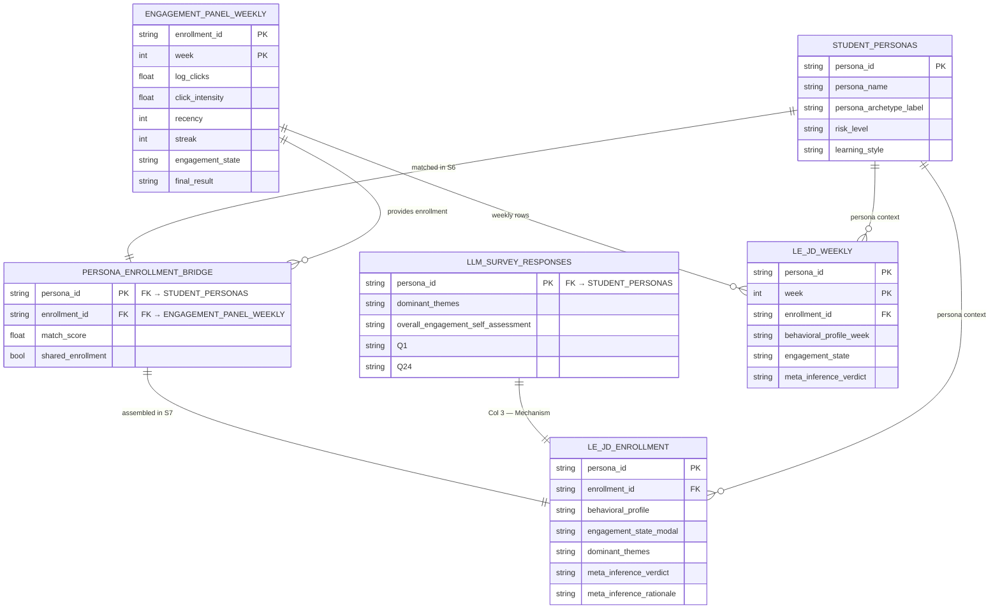

# Latent Engagement Joint Display (LE-JD): Artifact Definition and Construction Guide

---

## 1. Artifact Definition

*Reproduced verbatim from `proposal.md`, §6.4.*

A central contribution of this study is the development of a unifying artifact termed **Latent Engagement Joint Display (LE-JD)**.

The LE-JD extends the earlier idea of Latent Engagement Mapping by explicitly grounding the artifact in the mixed methods literature on **joint displays**. Rather than serving only as a summary table, the LE-JD is conceived as a structured analytical device for representing integration, aligning qualitative and quantitative evidence, and supporting the generation of meta-inferences. This approach follows the view that joint displays are not merely reporting tools, but also frameworks that help researchers organize data, compare findings, and identify integrated interpretations (Guetterman et al., 2015; Guetterman et al., 2021).

The artifact is designed according to several methodological principles emphasized in the literature. First, integration must be explicit rather than implied. Second, the artifact should facilitate the identification of meta-inferences rather than simply place qualitative and quantitative findings side by side. Third, qualitative and quantitative evidence should be represented at a comparable level of aggregation, since direct comparison between raw qualitative quotes and aggregated quantitative statistics can weaken interpretability and the coherence of integration (Guetterman et al., 2021). Finally, the display should improve clarity rather than introduce unnecessary visual or conceptual complexity.

Accordingly, the LE-JD aligns four core elements for each analytical unit:
- Behavioral indicators derived from OULAD
- Latent engagement states inferred from the quantitative model
- Qualitative mechanisms derived from thematic analysis
- Meta-inferences generated through integration

A simplified representation of the artifact is shown below:

| Student | Week | Behavioral Indicators | Latent Engagement | Mechanism | Meta-Inference |
|--------|------|----------------------|------------------|-----------|----------------|
| S1 | W3 | High clicks, low submission | Medium | Cognitive overload | Engagement without effective processing |
| S2 | W5 | No activity, high recency | Low | Low perceived value | Disengagement driven by utility perception |
| S3 | W2–6 | Stable activity, high streak | High | Habit formation | Sustained engagement through routine |

In methodological terms, the LE-JD functions as a **hybrid joint display**. It incorporates features of side-by-side displays by aligning qualitative and quantitative findings, features of statistics-by-themes displays by relating behavioral indicators to qualitative mechanisms, and features of model-based displays by introducing latent engagement as an interpretive layer. This hybrid structure is consistent with the recent evolution of joint displays toward more creative and analytically powerful visual formats (Guetterman et al., 2021).

A key refinement in the LE-JD is the deliberate alignment of aggregation levels across strands. Quantitative findings are represented through aggregated behavioral indicators and inferred latent states, while qualitative findings are represented through themes or mechanisms rather than isolated raw quotes. Quotes may still appear in supporting materials or as illustrative evidence, but the main artifact prioritizes thematic aggregation in order to strengthen comparability and interpretive fit. This design choice is directly supported by recommendations from the methodological review of visual joint displays, which found that integration is stronger when both strands are displayed at a consistent level of aggregation (Guetterman et al., 2021).

The LE-JD is also intended to support visual augmentation. In addition to the tabular display, the artifact may incorporate temporal trajectory plots, state-transition diagrams, or conceptual figures that link mechanisms to behavioral indicators. Such visual extensions are justified by the methodological literature, which argues that visual joint displays can reduce cognitive burden, communicate complex integrated findings more effectively, and support analytic reasoning during the integration process (Guetterman et al., 2021).

Most importantly, the LE-JD is not only a means of presenting results after analysis is complete. It also functions as a tool for conducting integration. In the process of deciding what to include, how to align the strands, and how to interpret convergence, divergence, or expansion, the artifact actively supports the development of mixed methods meta-inferences. In this sense, it is both an analytical framework and a reporting mechanism.

---

## 2. Input Tables

The LE-JD is assembled by `S7_le_jd_assembly.py` from four input files. The diagram below shows the tables and their join relationships.



| File | Rows | Produced by | Role in S7 |
|---|---|---|---|
| `outputs/engagement_panel_weekly.csv` | 1,212,577 | P0–P6 | Col 1 (behavioral) + Col 2 (engagement state proxy) |
| `outputs/data/synthetic/student_personas.csv` | 1,300 | S3 | Persona context columns |
| `outputs/data/synthetic/llm_survey_responses.csv` | 1,300 | S5 | Col 3 (mechanisms, Q1–Q24) |
| `outputs/data/synthetic/persona_enrollment_bridge.csv` | 1,300 | S6 | Join key — links each persona to one unique OULAD enrollment |

---

## 3. Construction — Step by Step

### Step 0 — Prerequisites

All four input files must exist. Run the pipeline stages in order if any are missing:

```bash
# Quantitative strand
python src/P0_foundation.py && python src/P1_ingestion.py && python src/P2_panel_builder.py
python src/P3_indicators.py && python src/P4_assessment_join.py
python src/P5_demographics_join.py && python src/P6_export.py
# → outputs/engagement_panel_weekly.csv

# Synthetic qualitative strand
python src_syntetic/S0_ingest_external_sources.py
python src_syntetic/S1_decode_and_normalize.py
python src_syntetic/S2_cluster_and_map.py
python src_syntetic/S3_persona_assembly.py
python src_syntetic/S4_generate_prompts.py
python src_syntetic/S5_run_llm_survey.py      # requires ANTHROPIC_API_KEY
# → outputs/data/synthetic/llm_survey_responses.csv

# Bridge (requires both strands above)
python src_syntetic/S6_persona_enrollment_bridge.py
# → outputs/data/synthetic/persona_enrollment_bridge.csv  (1,300 × 9)
```

---

### Step 1 — Assemble the artifact

```bash
cd next_proposal_paper/src_syntetic
/Users/rafars/.pyenv/versions/3.9.13/bin/python S7_le_jd_assembly.py
```

Expected output:

```
[1] Loading sources …  quali (1300×27) | bridge (1300×9) | personas (1300×39)
[2] Loading engagement_panel_weekly (rank-1 enrollments only) …  47,585 rows
[3] Aggregating quant to enrollment level …  1282 enrollments
[4] Assembling enrollment-level LE-JD …  (1300, 65)
[5] Assembling weekly LE-JD …  (48241, 29)
[6] Saving …
[7] Summary — Convergence 42.1% | Discordance 32.8% | Expansion 25.2%
Status : COMPLETE ✓
```

---

### Step 2 — Outputs

| File | Shape | Description |
|---|---|---|
| `outputs/data/synthetic/le_jd_enrollment.csv` | 1,300 × 65 | **Primary artifact** — 1 row per persona, all 4 LE-JD columns |
| `outputs/data/synthetic/le_jd_weekly.csv` | 48,241 × 29 | Temporal artifact — 1 row per persona × week |
| `outputs/metadata/s7_le_jd_audit.json` | — | Build audit and column manifest |

---

### Step 3 — Column structure

#### `le_jd_enrollment.csv`

| LE-JD Column | CSV columns | Note |
|---|---|---|
| **Context** (24 cols) | `persona_id`, `persona_name`, `persona_archetype_label`, `enrollment_id`, `code_module`, `code_presentation`, `final_result`, `match_score`, `shared_enrollment`, + demographics | `shared_enrollment = True` flags 18 personas where uniqueness could not be guaranteed |
| **Col 1 — Behavioral Indicators** (13 cols) | `behavioral_profile` *(label)*, `total_clicks_sum/mean`, `active_days_mean`, `log_clicks_mean`, `click_intensity_mean`, `recency_last`, `streak_max`, `cumulative_clicks_final`, `assessment_score_mean`, `submission_timeliness_mean`, `has_assessment_weeks`, `n_weeks` | |
| **Col 2 — Latent State** (1 col) | `engagement_state_modal` | Proxy (NTILE-3); replace with DBN output when available |
| **Col 3 — Mechanism** (25 cols) | `dominant_themes`, `Q1` … `Q24` | |
| **Col 4 — Meta-Inference** (2 cols) | `meta_inference_verdict`, `meta_inference_rationale` | Convergence / Expansion / Discordance |

#### `le_jd_weekly.csv`

Same four columns at week granularity: `behavioral_profile_week` (Col 1), `engagement_state` (Col 2), `dominant_themes` (Col 3), `meta_inference_verdict` (Col 4).

---

### Step 4 — Replace proxy with DBN output (future)

Col 2 is currently populated with `engagement_state_modal`, a NTILE-3 proxy. When the DBN is trained:

1. Run the DBN on `engagement_panel_weekly.csv` (input nodes: `log_clicks`, `click_intensity`, `recency`, `streak`, `active_days`, `has_assessment_this_week`, `assessment_score`, `submission_timeliness`).
2. The DBN emits a discrete latent state per `enrollment_id × week`.
3. Replace `engagement_state_modal` / `engagement_state` in both LE-JD files with the DBN output.
4. Re-run S7 to regenerate `meta_inference_verdict` against the true inferred state.

> `engagement_state` in `engagement_panel_weekly.csv` remains as the **validation reference**, not the artifact value.
